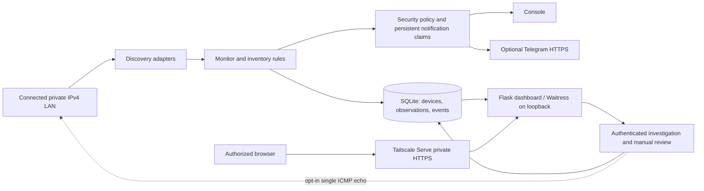

# NetWatch — Self-Hosted LAN Monitoring & Security Dashboard

A self-hosted Linux application for discovering LAN devices, preserving their
history, and reviewing security evidence through a mobile-friendly dashboard.
NetWatch combines bounded network discovery, a SQLite inventory, explicit device
review, and optional Telegram alerts. It is built for private networks and homelabs.

**Current source version: 0.1.0.** This repository contains the existing application,
including Unknown Device Investigation. Version 1.0 release criteria have not been
established. No production configuration, inventory, credentials, or screenshots
are distributed.

## What it does

- **LAN discovery:** passive Linux neighbour inspection by default; opt-in, bounded
  ping and `nmap -sn` discovery on directly connected RFC1918 IPv4 networks.
- **Persistent inventory:** MAC identities, current/previous IPs, first/last seen,
  observations, vendor/hostname hints, operator labels, notes, and event history.
- **Explicit review:** TRUSTED, KNOWN, UNKNOWN, and BLOCKED. Classification requires
  an operator action. **BLOCKED is monitoring-only; it does not block traffic.**
- **Security Overview:** evidence-derived SECURE / ATTENTION / ALERT status,
  monitor health, unknown review cards, and security history for 24h / 7d / 30d.
  The logical inventory map does not establish physical network topology.
- **Telegram alerts:** opt-in security notifications, persisted event deduplication,
  at least a one-hour identical-evidence cooldown, bounded retries, and a bounded
  background queue. Delivery is best effort; ambiguous retries may duplicate a message.
- **Mobile dashboard:** responsive inventory, device details, history, filters,
  UTC timestamps, relative times, and accessible touch controls. No frontend build.
- **Private HTTPS access:** loopback-only backend with configurable Tailscale Serve
  authority. Tailnet access policy remains the operator's responsibility.
- **Web protections:** optional scrypt password authentication, signed sessions,
  CSRF and same-origin checks, Host validation, escaped HTML, restricted cookies,
  and untrusted forwarded-header stripping. Set `web_auth_required: true` after
  configuring a password to fail closed if the hash is missing.
- **Unknown Device Investigation:** authenticated, CSRF-protected evidence review
  for UNKNOWN devices. It stores bounded conclusions, explains uncertainty and
  possible matches, and never changes identity or trust. Optional reachability
  sends at most one ICMP echo to a fresh, validated LAN address; no port probing.
- **Reliability:** transactional SQLite persistence, WAL snapshots, process locking,
  finite discovery budgets, graceful shutdown, and monitoring that continues after
  recoverable errors. Failed/degraded scans preserve prior liveness where required.

## Architecture



See [architecture](docs/ARCHITECTURE.md) for component responsibilities and failure
boundaries. Tailscale and Telegram are optional; neither is needed by CI.

## Quick start

Requires Linux and Python 3.12 or newer. Install `iproute2`; `iputils-ping` and
`nmap` are needed only for their optional discovery methods.

```bash
git clone https://github.com/tilemachoscfu/netwatch.git
cd netwatch
python3 -m venv .venv
.venv/bin/python -m pip install -r requirements.txt
.venv/bin/python -m pip install .
cp netwatch.example.yaml netwatch.yaml
# Review configuration and confirm authorization for the chosen LAN first.
.venv/bin/netwatch --config netwatch.yaml scan
.venv/bin/netwatch --config netwatch.yaml set-password
# Set web_auth_required: true in your private netwatch.yaml.
.venv/bin/netwatch --config netwatch.yaml monitor
# In a second terminal:
.venv/bin/netwatch --config netwatch.yaml web
```

Open `http://127.0.0.1:8765` on that machine. The configured username is `netwatch`.
For another device, configure private HTTPS access as described in the
[installation guide](docs/INSTALLATION.md). No public dashboard bind is provided.
Keep credentials out of YAML and Git. Do not enable Tailscale Funnel.

## Testing and quality

```bash
.venv/bin/python -m pip install -e '.[dev]'
.venv/bin/python -m pytest --cov=netwatch --cov-report=term-missing
.venv/bin/python -m ruff check .
.venv/bin/python -m ruff format --check .
node --check netwatch/web/static/app.js
node tests/dashboard_polling.mjs
node tests/mobile_ui.mjs
node tests/check_investigation_ui.mjs
.venv/bin/python scripts/check_publication.py
.venv/bin/python -m build
```

The full Python suite uses synthetic fixtures and blocks real network/subprocess
operations. The JavaScript behaviour checks use isolated DOMs. Optional real-browser
layout scripts require a separate synthetic dashboard and browser session; CI does
not connect them to a live installation. CI also checks runtime dependencies,
publication hygiene, and Git history with Gitleaks. See [contributing](CONTRIBUTING.md).

## Documentation

- [Installation and systemd](docs/INSTALLATION.md)
- [Configuration, CLI, API and alert reference](docs/REFERENCE.md)
- [Architecture](docs/ARCHITECTURE.md)
- [Backup and restore](docs/BACKUP_RESTORE.md)
- [Security policy and limitations](SECURITY.md)
- [Changelog](CHANGELOG.md)

Screenshots are intentionally omitted because the available captures contain
private device inventory. [Screenshot guidance](docs/screenshots/README.md)
requires an isolated synthetic fixture before adding images.

## Limitations and roadmap

Passive discovery can miss silent/sleeping devices. MACs, names and OUI information
are spoofable and do not authenticate a physical device. SECURE means no currently
actionable stored evidence under the implemented rules; it is not a vulnerability
assessment. Notification delivery has no durable retry queue or guaranteed receipt.
Inventory/history retention can grow over time. Authentication has one shared role.

Future work may include independently validated model evidence, opt-in service
metadata, retention controls, role separation, and durable notification delivery.
These are planned ideas, not implemented features. IPv6, routed VLAN discovery,
packet inspection, intrusion prevention, and actual network blocking are outside
current functionality.

## License

[MIT](LICENSE). The repository retains the project's existing MIT license;
third-party software remains subject to its own license. See
[dependency notes](docs/DEPENDENCIES.md).
